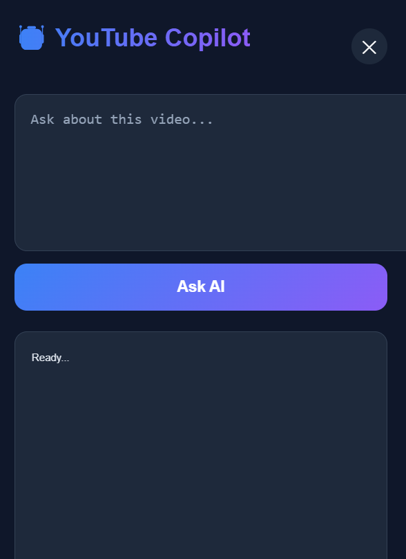
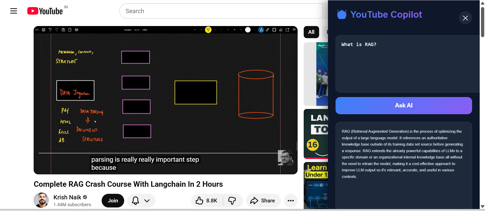

# 🎥 YouTube Copilot - RAG Based Chrome Extension

AI-powered Chrome Extension that allows users to chat with any YouTube video using Retrieval-Augmented Generation (RAG).

Instead of manually searching through hours of video content, users can ask questions and receive contextual answers directly from the video's transcript.

---

## 🚀 Features

* 🎥 Works directly on YouTube
* 🤖 AI-powered question answering using Gemini
* 📄 Automatic transcript extraction
* 🔍 Semantic search using FAISS Vector Database
* 🧠 Retrieval-Augmented Generation (RAG)
* ⚡ FastAPI backend
* 🎨 Clean Chrome Extension UI
* 💬 Natural language querying

---

## 🏗️ Architecture

```text
YouTube Video
      ↓
Transcript Extraction
      ↓
Text Chunking
      ↓
Embeddings (all-MiniLM-L6-v2)
      ↓
FAISS Vector Store
      ↓
Retriever
      ↓
Gemini 2.5 Flash
      ↓
Answer Generation
      ↓
Chrome Extension UI
```

---

## 🛠️ Tech Stack

### Frontend

* JavaScript
* HTML
* CSS
* Chrome Extension Manifest V3

### Backend

* FastAPI
* LangChain

### AI / RAG

* Google Gemini 2.5 Flash
* HuggingFace Embeddings
* FAISS Vector Database
* YouTube Transcript API

---

## 📂 Project Structure

```text
youtube-rag-copilot/

├── backend/
│   ├── app.py
│   ├── rag.py
│   ├── requirements.txt
│   └── .env
│
├── chrome-extension/
│   ├── manifest.json
│   ├── content.js
│   ├── content.css
│   └── sidebar.html
│
└── README.md
```

---

# ⚙️ Setup Instructions

## 1️⃣ Clone Repository

```bash
git clone https://github.com/arushiranjan/RAG-based-youtube-copilot.git

cd RAG-based-youtube-copilot
```

---

## 2️⃣ Setup Backend

Navigate to backend folder:

```bash
cd backend
```

Create virtual environment:

```bash
python -m venv .venv
```

Activate:

### Windows

```bash
.venv\Scripts\activate
```

### Linux / Mac

```bash
source .venv/bin/activate
```

Install dependencies:

```bash
pip install -r requirements.txt
```

---

## 3️⃣ Configure Environment Variables

Create a `.env` file:

```env
GOOGLE_API_KEY=YOUR_GEMINI_API_KEY
```

---

## 4️⃣ Run Backend

```bash
uvicorn app:app --reload
```

Backend will start on:

```text
http://127.0.0.1:8000
```

Swagger Documentation:

```text
http://127.0.0.1:8000/docs
```

---

# 🌐 Load Chrome Extension

Open Chrome:

```text
chrome://extensions
```

Enable:

```text
Developer Mode
```

Click:

```text
Load Unpacked
```

Select:

```text
chrome-extension/
```

folder.

---

# ▶️ Usage

1. Start FastAPI backend.
2. Open any YouTube video.
3. Extension sidebar appears.
4. Ask a question about the video.
5. Get AI-generated answers grounded in the transcript.

Example:

```text
What is RAG?

How does vector search work?

Summarize this video.
```

---

# 📸 Screenshots

## Extension UI

Add screenshot here:

```markdown

```

## Answer Generation

Add screenshot here:

```markdown

```

---

# 🔮 Future Enhancements

### Timestamp-Based Citations

```text
Answer
  ↓
Source Timestamps
  ↓
Jump to Video Section
```

Example:

```text
Sources:

⏱ 03:24
⏱ 15:42
⏱ 28:11
```

---

### Multi-Language Support

Support:

* English
* Hindi
* Tamil
* Telugu
* Bengali
* Other available transcript languages

---

### Video Summarization

Generate concise summaries of long videos.

---

### Quiz Generation

Create MCQs directly from video content.

---

### Flashcards

Generate revision flashcards from educational videos.

---

### Notes Generation

One-click study notes from lectures.

---

### Chat History

Persist previous conversations per video.

---

### Cross-Video Search

Ask questions across multiple videos.

Example:

```text
Compare RAG concepts explained in Video A and Video B
```

---

# 🎯 Use Cases

* Students
* Developers
* Researchers
* Content Consumers
* Online Courses
* Technical Tutorials

---

# 👨‍💻 Author

**Arushi Ranjan**

GitHub:

https://github.com/arushiranjan

---

# ⭐ Support

If you found this project useful, consider giving it a star on GitHub.
